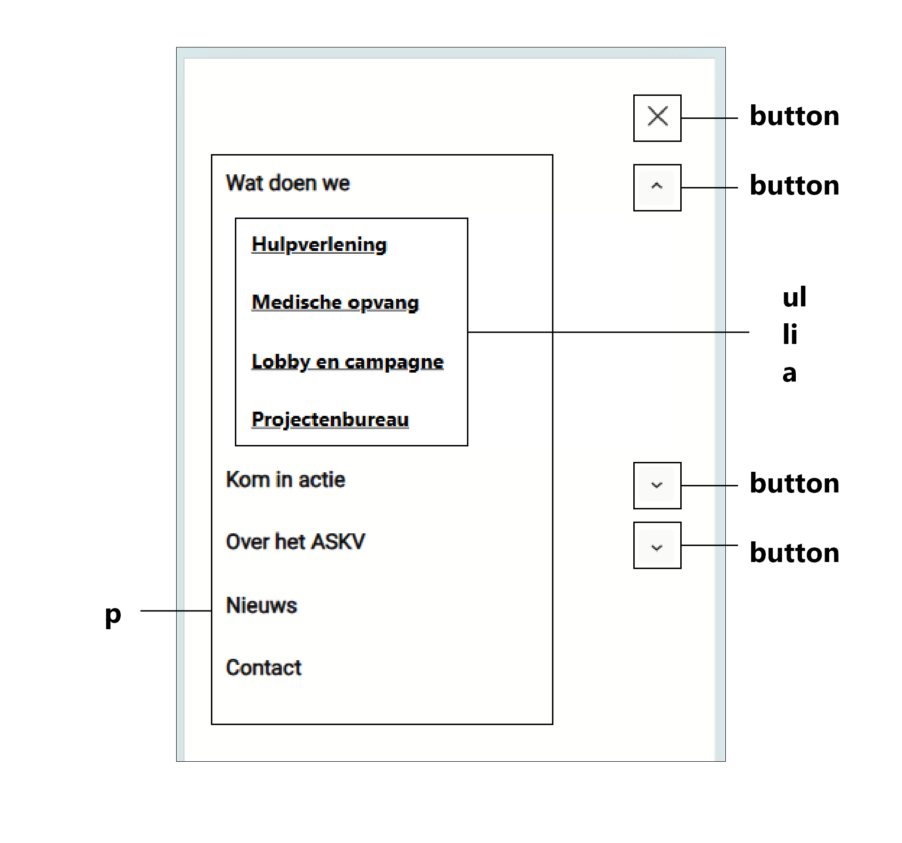
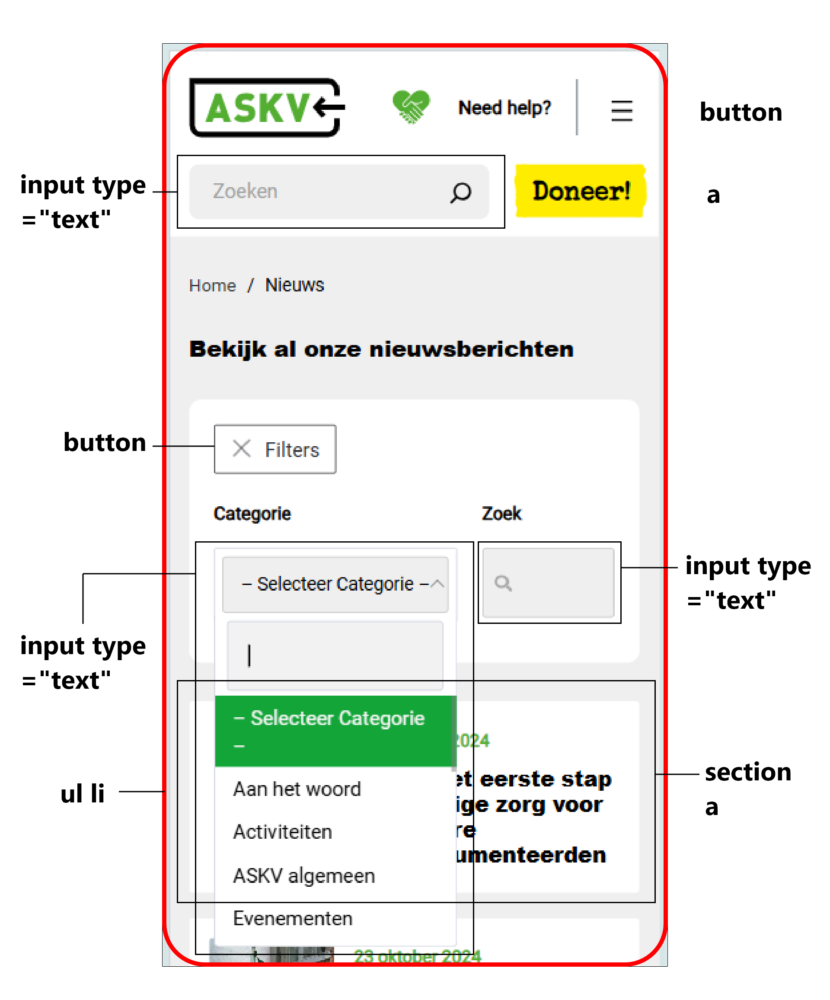
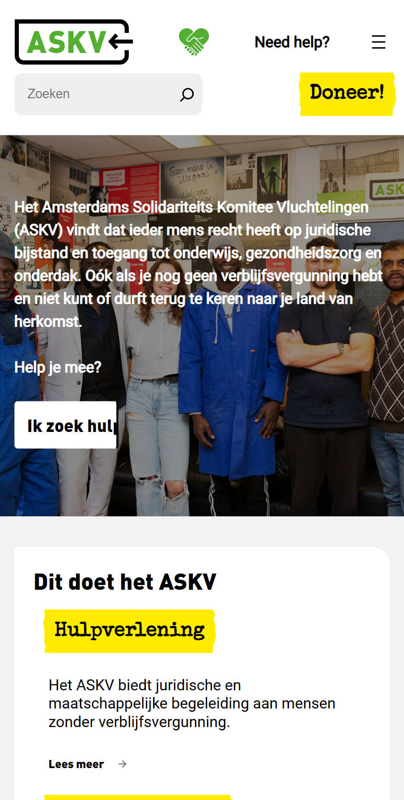

# Procesverslag
Markdown is een simpele manier om HTML te schrijven.  
Markdown cheat cheet: [Hulp bij het schrijven van Markdown](https://github.com/adam-p/markdown-here/wiki/Markdown-Cheatsheet).

Nb. De standaardstructuur en de spartaanse opmaak van de README.md zijn helemaal prima. Het gaat om de inhoud van je procesverslag. Besteedt de tijd voor pracht en praal aan je website.

Nb. Door *open* toe te voegen aan een *details* element kun je deze standaard open zetten. Fijn om dat steeds voor de relevante stuk(ken) te doen.

## Jij

  
uitwerken voor kick-off werkgroep

  ### Auteur:
  Red de Romas

  #### Je startniveau:
  Startniveau: Blauwe piste  
  Coderen vind ik in het algemeen heel erg moeilijk en uitdagend. 
  Vaak raak ik in de waar of wat ik aan doen ben klopt of niet. 
  Toch ben ik wel bereid om te doen wat ik kan om meer te leren.

  #### Je focus:
  Gekozen focus: Surface plane
 

## Je website

  
uitwerken voor kick-off werkgroep

  ### Je opdracht:
  Mijn gekozen website: ASKV  
  Link naar de website: https://www.askv.nl/

  #### Screenshot(s) van de eerste pagina (small screen): 
  Home Pagina  
  
  
  
  
  

  #### Screenshot(s) van de tweede pagina (small screen):
  Doneer Pagina  
  
  
  
 

## Toegankelijkheidstest 1/2 (week 1)

  
uitwerken na test in 2e werkgroep

  ### Bevindingen
  Lijst met je bevindingen die in de test naar voren kwamen:
  - Meeste elementen worden van links naar rechts, van boven naar beneden gelezen door de Voice Narrator.
  - Sommige tekstelementen worden overgeslagen.
  - De structuur is logisch.
  - De headings worden helemaal NIET gelezen.
  - H1 wordt niet gelezen. Is deze hidden?
  - H2 en H3 zijn er wel.
  - Veel elementen hebben een koppeling. Deze leiden naar een andere pagina toe. Die zijn wel juist.
  - Het wordt aangegeven waar de links naartoe worden geleid.
  - De website is erg inconsistent. De structuur en volgorde van de elementen kunnen een stuk verbeterd worden.
  - De website heeft geen “dark mode”.
  - De website kan toegankelijker worden voor iedereen.
  - Het is niet duidelijk dat de sectie van het laatste nieuws meerdere items nieuwsitems heeft.

## Breakdownschets (week 1)

  
uitwerken na afloop 3e werkgroep

  ### de home en de doneer pagina's: 
    
  

  ### dynamisch deel (bijv menu): 
    

  ### wellicht nog een dynamisch deel (bijv filter): 
    

## Voortgang 1 (week 2)

  
uitwerken voor 1e voortgang

  ### Stand van zaken
  - Ik weet niet zo goed of ik mijn HTML-elementen, specifiek de sections juist heb benoemd. Ik weet niet zo goed wanneer ik bijvoorbeeld een article en/of figure moet gebruiken.
  - Ik zat een beetje vast met hoe ik de fonts juist kon coderen in mijn CSS. Wat is de juiste manier om het te doen? Ik heb meerdere keren gezocht op DLO, maar kon hem nergens vinden.
  
  ### Agenda voor meeting
  samen met je groepje opstellen

  | Jaron      | Casper          | Luca    | Red        |
  | ---            | ---                | ---          | ---              |
  | dit bespreken  | en dit             | en ik dit    | HTML-controleren    |
  | en dat ook nog | dit als er tijd is | nog een punt | Foto's/iconen responsief maken |
  | ...            | ...                | ...          | ...              |

  ### Verslag van meeting
  hier na afloop snel de uitkomsten van de meeting vastleggen

  - De HTML van mijn eerste pagina moet ik nog een keer goed controleren  
  Hetzelfde geldt voor mijn tweede pagina.
  - Check a11y om content te verbergen en de algemene styling van CSS te verbeteren.
  
  Geleerd:
  - aria-label gebruiken
  - <abbr></abbr>
  - <h1 lang="..."> gebruiken als er een woord is in het Engels en/of een andere taal.
  - Downloaden van fonts op de juiste manier: Inspect > Netwerk > Fonts > Downloaden.
  - Decoratieve foto's/iconen hoeven geen alt tekst, die mag je leeglaten.

## Voortgang 2 (week 3)

  
uitwerken voor 2e voortgang

  ### Stand van zaken
  De afgelopen week heb ik een groot deel van de HTML van mijn 2 pagina's af. Ik zit vast met hoe ik de foto's/iconen responsief moet maken. Ik vind het ook uitdagend om mijn website vorm te geven met CSS.

  - Ik heb de logo die als een terugknop dient. Hoe kan ik dit het beste benoemen in mijn HTML?
  - Ik heb twee elementen als afbeeldingen die ik voor en achter een bepaalde tekst moet zetten. Kan ik die ook toevoegen in mijn CSS of beter in mijn HTML?
  - Klopt mijn fieldset met opties om te kiezen of kan ik deze beter als buttons benoemen in mijn HTML?

  ### Agenda voor meeting
  samen met je groepje opstellen

  | Jaron      | Casper          | Luca    | Red        |
  | ---            | ---                | ---          | ---              |
  | dit bespreken  | en dit             | en ik dit    | Foto's/iconen responsief maken    |
  | en dat ook nog | dit als er tijd is | nog een punt | Wanneer mag ik divs/classes gebruiken? |
  | ...            | ...                | ...          | ...              |

  ### Verslag van meeting
  hier na afloop snel de uitkomsten van de meeting vastleggen

  - Maak gebruik van responsive waardes als het gaat om bepaalde images/iconen, margins en paddings: denk aan em, rem of % in plaats van px.
  - Divs/clasees gebruik je als het niet anders kan, vooral als het gaat om het positioneren van de elementen.

  Geleerd: 
  - Hoe ik een zoekbalk juist kan stijlen.
  - Toepassen van een carousel
  - Het gebruiken van max-width

## Toegankelijkheidstest 2/2 (week 4)

  
uitwerken na test in 9e werkgroep

  ### Bevindingen
  Lijst met je bevindingen die in de test naar voren kwamen (geef ook aan wat er verbeterd is):
  - De volgorde van de elementen worden juist gelezen van links naar rechts. 
  - Het is net als de echte website. Het wordt van boven naar beneden gelezen door de Voice Narrator.
  - Sommige tekstelementen worden overgeslagen, maar het blijkt dat ik simpelweg de juiste commands moet gebruiken om ervoor te zorgen dat de Voice Narrator deze leest. Dus die werkt prima!
  - De headings worden wel gelezen (H2 en H3), H1 niet omdat deze hidden is.
  - De links/koppelingen worden gelezen.
  - De volgorde van de elementen zijn verbeterd.
  - De alts van de images/iconen worden nu gelezen en goed beschreven.

## Voortgang 3 (week 4)

  
uitwerken voor 3e voortgang

  ### Stand van zaken
  Hier dit ging goed & dit was lastig (neem ook screenshots op van delen van je website en code):
  - Het stylen met CSS vind ik nog steeds lastig.
  - Het stylen van de gelen links/buttons was mij gelukt.
  - De elementen in de header juist zetten.
  - Sommige sections in mijn website hebben twee achtergrond kleuren, 
  maar het lukte me niet om hetzelfde te doen. Hoe kan ik dat het beste doen?

  ### Agenda voor meeting
  samen met je groepje opstellen

  | Jaron      | Casper          | Luca    | Red        |
  | ---            | ---                | ---          | ---              |
  | dit bespreken  | en dit             | en ik dit    | en dan ik dat    |
  | en dat ook nog | dit als er tijd is | nog een punt | dit wil ik zeker |
  | ...            | ...                | ...          | ...              |

  ### Verslag van meeting
  hier na afloop snel de uitkomsten van de meeting vastleggen

  - Je moet ze specifiek benoemen om ze juist te kunnen selecteren.
  - De kleuren kunnen simpelweg worden aangepast met in de <html>. De andere kleuren worden dan apart vormgegeven.
  - Na deze voortgang  heb ik mijn HTML opnieuw gecheckt en deze juist gecontroleerd.
  - Voor de rest ging ik verder werken aan mijn CSS.

## Eindgesprek (week 5)

  
uitwerken voor eindgesprek

  ### Je uitkomst - karakteristiek screenshots:
  
  Navigatie met hamburger menu + Eerste section met animatie
  " width="375px">
  Tweede section met algemene informatie
  " width="375px">
  Derde section met afbeelding
  " width="375px">
  

  ### Dit ging goed/Heb ik geleerd: 
  Korte omschrijving met plaatjes

  

  ### Dit was lastig/Is niet gelukt:
  Korte omschrijving met plaatjes

  

## Bronnenlijst

  
continu bijhouden terwijl je werkt

  Nb. Wees specifiek ('css-tricks' als bron is bijv. niet specifiek genoeg). 
  Nb. ChatGpT en andere AI horen er ook bij.
  Nb. Vermeld de bronnen ook in je code.

  1. Gebruiken van een link placeholder: https://stackoverflow.com/questions/4855168/what-is-href-and-why-is-it-used
  2. Tijd sematisch correct benoemen in het HTML: https://www.w3schools.com/tags/tag_time.asp  
  3. Input tag op de juiste manier gebruiken: https://www.w3schools.com/tags/tag_input.asp 
  4. Foto's extracteren: https://extract.pics/
  5. Gebruiken van een fieldset: https://www.w3schools.com/TAGS/tag_legend.asp  
  6. Telefoonnummers: https://www.w3docs.com/snippets/html/how-to-add-telephone-links-with-html.html 
  7. Toegankelijkheid labels: https://www.w3schools.com/accessibility/accessibility_labels.php
  8. Het gebruiken van ARIA: https://developer.mozilla.org/en-US/docs/Web/Accessibility/ARIA 
  9. ::before & ::after pseudoelementen:  https://youtu.be/zGiirUiWslI?si=XQy3Yh0tfmlm4tF6 
  10. Hoe maak ik een afbeelding donkerder:
  - https://dev.to/nazanin_ashrafi/how-to-darken-an-image-with-css-4f5h
  - https://www.w3schools.com/cssref/func_brightness.php 
  11. Light-Dark mode: https://developer.mozilla.org/en-US/docs/Web/CSS/color_value/light-dark 
  12. Carrousel: https://codepen.io/shooft/pen/abmLRMg 
  13. Custom Radio Buttons: https://youtu.be/mouR7XHcQ0k?si=dC6eYQ-dw_P8rKWw 
  14. ::checked: https://youtu.be/waxpaXYwn_s?si=9cC0mnQS7yyJ0TT4 
  15. details & summary tags - collapsible:
  16. https://youtu.be/fSkhTd4rpDo?si=43btzjB1cnPoJHfv 
  17. Embed video: https://youtu.be/ly36kn0ug4k?si=ESLzXHEuFTOZU00i 
  18. Video: https://youtu.be/BAx2GaMW2qA?si=zwi70ydKLRGNVZKC 
  19. Bron van het gebruikte filmpje: 
  20. https://youtu.be/Ool30jokUVQ?si=oiL_3276iyVjINmG 
  21. Eerste poging met collapsible content: https://codepen.io/DRdeRomas/pen/XJrBKbe?editors=0100 
  23. Navigatie hamburger menu: 
  - https://codepen.io/shooft/pen/JjQLVeB 
  - https://codepen.io/shooft/pen/VwJXNEg?editors=1100 
  24. ChatGPT:
  - Collapsible: https://chatgpt.com/share/678a9940-6174-800c-89ac-5c2a5ee6be5b 
  - Optie Anders: https://chatgpt.com/c/678ab0fd-d218-800c-ac1c-915f57b99edd
  25. Focus state: https://css-tricks.com/almanac/pseudo-selectors/f/focus/ 

